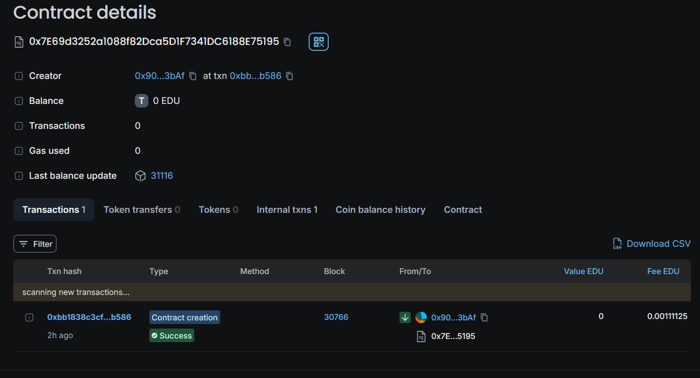

# Decentralized Asset Management Platform

## Vision


The Decentralized Asset Management Platform aims to revolutionize asset management by leveraging blockchain technology. By using the Omagawd token (OMGD), this platform enables secure, transparent, and efficient asset transactions. Users can create, manage, and trade assets with confidence, all while ensuring data integrity and minimizing intermediary involvement.

## Flowchart

Below is a simplified flowchart of the platform's workflow:
```plaintext
   +--------------------+
   |  User Registration |
   +--------------------+
             |
             v
   +----------------------+
   |  Deploy OmagawdToken |
   +----------------------+
             |
             v
   +------------------------+
   |   Create Asset via     |
   |     AssetManager       |
   +------------------------+
             |
             v
   +------------------------+
   |   Buy/Sell Assets      |
   |   using OMGD Tokens   |
   +------------------------+
             |
             v
   +------------------------+
   |   Record Transactions  |
   |   on the Blockchain    |
   +------------------------+
             |
             v
   +------------------------+
   |   View Assets and      |
   |   Transaction History  |
   +------------------------+
```

## Contract Details

- **Contract Name**: Decentralized Asset Management Platform 

- **Admin**: 0xB7cdD5D06D8d50DD4739a9a1f0EbFa115Bd78014




## Contract Addresses
- **AssetManager**: 0x957887D2EDAA198F4bCAE90FFD46041A73C6b491

## Future Scope

- **User Interface**: Develop a web-based UI for easier interaction with the platform.
- **Enhanced Security**: Implement additional security measures and conduct audits.
- **Scalability**: Optimize the platform for higher transaction volumes and lower costs.
- **Integration**: Explore integrations with other decentralized finance (DeFi) platforms and services.

## Contact Details

For inquiries or support, please contact:

- **Name**: Kevin Kashung
- **Email**: itskevinks@gmail.com
- **GitHub**: https://github.com/Reiyonnaise
- **LinkedIn**: https://www.linkedin.com/in/kevin-kashung-073794250


Thank you for exploring the Decentralized Asset Management Platform. I look forward to your feedback and contributions!
